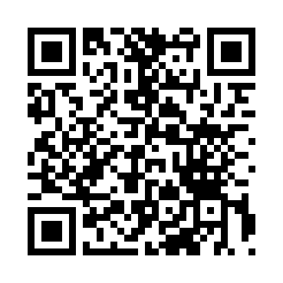

# 📱 Baixar AgroColetor

**📲 Escaneie o QR Code acima com a câmera do celular**

ou

**🔗 [CLIQUE AQUI PARA BAIXAR](https://github.com/SauloRodrigues20/Agrogeocolector/releases/latest)**

---

## ⚡ Instalação Rápida

**3 passos simples:**

1. **Baixe** o arquivo APK
2. **Permita** instalação de apps desconhecidos
3. **Instale** e use!

📖 **[Guia Completo de Instalação →](INSTALACAO_APK.md)**

---

## 🏪 Em Breve na Google Play Store!

Estamos preparando o app para lançamento na Play Store.

Enquanto isso, você pode baixar diretamente do GitHub usando o QR Code acima.

---

## ✨ O que é o AgroColetor?

Aplicativo profissional para **coleta e georreferenciamento** de amostras de solo.

### Funcionalidades:

- 🗺️ **Mapas offline** gratuitos (OpenStreetMap)
- 📍 **GPS de alta precisão**
- 📸 **Captura de fotos**
- 💾 **Funciona sem internet**
- ☁️ **Sincronização automática**
- 🆓 **100% gratuito**

---

## 📱 Requisitos

- Android 8.0 ou superior
- GPS habilitado
- 30 MB de espaço livre

**Funciona em:** Samsung, Xiaomi, Motorola, LG, Asus, etc.

---

## 🆘 Precisa de Ajuda?

- 📖 [Guia de Instalação Completo](INSTALACAO_APK.md)
- 🔧 [Como Usar o App](COMO_USAR.md)
- 💬 [Reportar Problema](https://github.com/SauloRodrigues20/Agrogeocolector/issues)
- ⭐ [Código Fonte](https://github.com/SauloRodrigues20/Agrogeocolector)

---

**🌱 Desenvolvido para a Agronomia Brasileira 🇧🇷**

